# Nimbalyst Visual Map

Use this as the structure for the Nimbalyst project board.

```mermaid
flowchart TD
  A["TaskOverlay Project"] --> B["Goals"]
  A --> C["Roadmap"]
  A --> D["Active Sprint"]
  A --> E["Module Map"]
  A --> F["Risks"]
  A --> G["Decisions"]
  A --> H["GitHub Backup"]

  B --> B1["Long Term: Game Script Automation"]
  B --> B2["Short Term: CCD Camera Effect Check"]
  B --> B3["Product: Local Planning Assistant"]

  C --> C1["Phase 1: Stable Overlay"]
  C --> C2["Phase 2: CLI/API Control"]
  C --> C3["Phase 3: Planning Assistant"]
  C --> C4["Phase 4: Project Management"]
  C --> C5["Phase 5: AI Refinement"]

  E --> E1["Overlay"]
  E --> E2["Task Center"]
  E --> E3["Local API"]
  E --> E4["CLI"]
  E --> E5["Planning Algorithm"]
  E --> E6["Storage / Backup"]
  E --> E7["Hotkey Bridge"]

  D --> D1["Current Tasks"]
  D --> D2["Blocked Items"]
  D --> D3["Validation Checklist"]

  H --> H1["Commit Before Large Changes"]
  H --> H2["Push To origin/main"]
  H --> H3["Keep Runtime Data Backed Up"]
```

## Suggested Nimbalyst Nodes

- TaskOverlay Project: overview and current status.
- Goals: long-term, short-term, product goals.
- Roadmap: phases and status.
- Active Sprint: current working tasks.
- Module Map: code ownership boundaries.
- Risks: runtime, data, hotkeys, planning, UI clipping.
- Decisions: lightweight choices before ADR.
- GitHub Backup: commit/push routine and recovery notes.

## Suggested Links

- Goals -> Planning Algorithm: goals feed local planning.
- Planning Algorithm -> External Proposal: suggestions need confirmation.
- CLI/API -> External Proposal: AI and scripts submit safely.
- Task Center -> Settings/Data Management: detailed user control belongs there.
- GitHub Backup -> all nodes: push before large local experiments.

