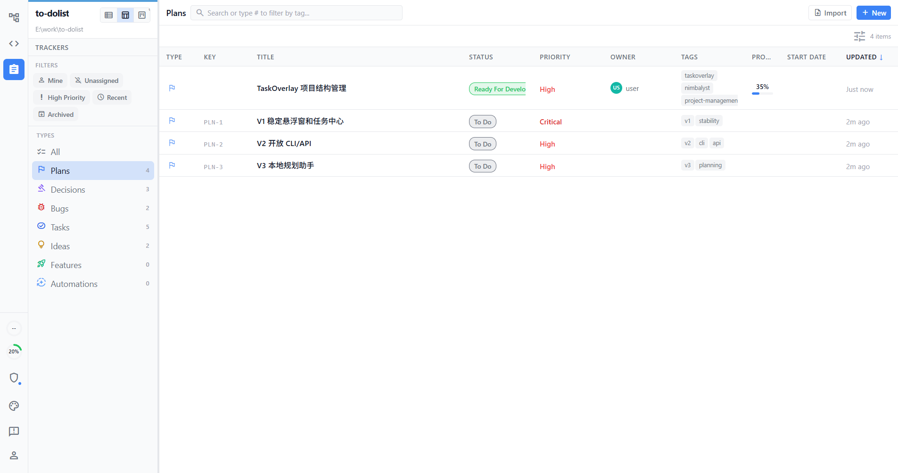

# Nimbalyst Project Management UAT

Date: 2026-06-14

## Result

Project management data is now visible in Nimbalyst for workspace `E:\work\to-dolist`.

Verified counts after refreshing the Nimbalyst renderer:

- Plans: 4
- Decisions: 3
- Bugs: 2
- Tasks: 5
- Ideas: 2
- Features: 0
- Automations: 0

## Verified Views

- Decisions view shows the stability-first, local-first planning, and proposal-before-task decisions.
- Tasks view shows the CCD acceptance task, game automation MVP task, UI clipping task, hotkey bridge task, and project structure task.
- Plans view shows the TaskOverlay project management plan plus V1/V2/V3 phase plans.

## Source Files

- `nimbalyst-local/plans/taskoverlay-project-management.md`
- `nimbalyst-local/tracker/plans.md`
- `nimbalyst-local/tracker/decisions.md`
- `nimbalyst-local/tracker/bugs.md`
- `nimbalyst-local/tracker/tasks.md`
- `nimbalyst-local/tracker/ideas.md`

## Screenshot

## Notes

Nimbalyst did not immediately auto-import new tracker Markdown files into its running tracker database. For this UAT, the tracker database was seeded from the same Markdown content, then the Electron renderer was refreshed through its DevTools port. The Markdown files remain the recoverable project source for GitHub backup.
