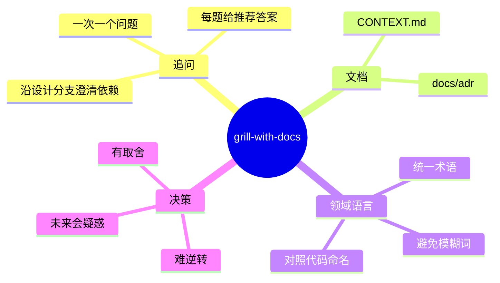
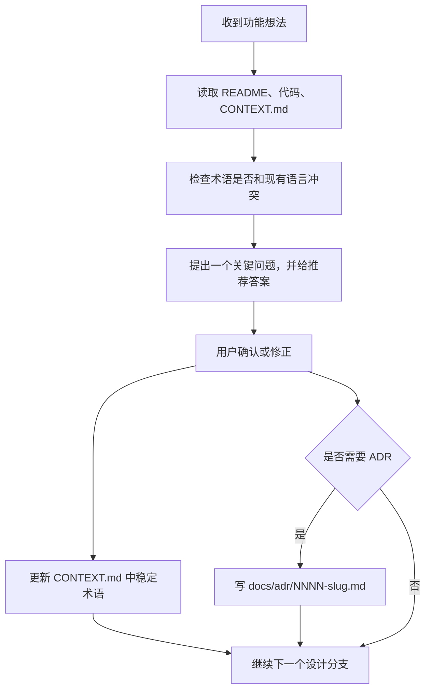

# Grill With Docs 学习笔记

Source:
- Bilibili: https://www.bilibili.com/video/BV1ko5b6oEG5/
- Original YouTube: https://www.youtube.com/watch?v=6BB6exR8Zd8
- Article: https://www.aihero.dev/grill-with-docs
- Skill source: https://github.com/mattpocock/skills/blob/main/skills/engineering/grill-with-docs/SKILL.md

Generated: 2026-06-12

## 1. 一句话总结

`grill-with-docs` 是 `grill-me` 的代码库版本：让 AI 在动手实现前逐个追问方案、对照代码和现有文档澄清领域语言，并把稳定下来的术语写入 `CONTEXT.md`，把少数重大架构取舍写入 ADR。

## 2. 核心结论

- 有代码库时，优先用 `grill-with-docs`，不要只用普通追问式规划。
- `CONTEXT.md` 不是需求文档，也不是实现计划；它只保存领域词汇和边界语言。
- ADR 只记录难逆转、非显而易见、存在真实取舍的决策，避免把所有讨论都写成文档。
- AI 的追问必须落到代码和具体场景上：如果问题能通过读代码回答，就先读代码。

## 3. 知识结构

## 4. 方法流程

## 5. 关键术语

| 术语 | 解释 | 用在 TaskOverlay 时的含义 |
|---|---|---|
| `grill-me` | AI 通过连续追问迫使需求更清晰。 | 适合无代码上下文的想法整理。 |
| `grill-with-docs` | 在追问基础上加入代码对照、领域词汇和 ADR。 | 适合 TaskOverlay 新功能规划。 |
| `CONTEXT.md` | 领域词汇表，只写项目特有概念。 | 放在仓库根目录，解释“悬浮窗、任务中心、外部提案”等术语。 |
| ADR | 记录重大、难逆转、带取舍的架构决策。 | 放在 `docs/adr/`，例如为何 CLI 默认走提案箱。 |
| Ubiquitous Language | 代码、开发者、领域使用者共享的一套语言。 | 避免 “proposal / external task / AI task” 反复混用。 |

## 6. 应用到 TaskOverlay

本项目适合单一上下文：它是一个桌面待办工具，不需要 `CONTEXT-MAP.md`。应新增根级 `CONTEXT.md`，把产品概念固定下来：

- **Overlay**：桌面悬浮窗，不等于任务中心。
- **Task Center**：完整管理窗口，不等于悬浮窗。
- **External Proposal**：外部程序、CLI 或 AI 提交的待确认任务。
- **Task**：用户确认后进入正式任务列表的事项。
- **Local API**：仅本机监听、通过令牌控制的接口层。
- **CLI**：面向人和 agent 的命令行控制面。

下一次开发时，不应直接实现用户一句话需求；先用 skill 做一轮短追问，明确：

1. 新概念是否已有领域词。
2. 新行为属于悬浮窗、任务中心、CLI、API 还是存储层。
3. 是否影响外部提案确认边界。
4. 是否需要 ADR。

## 7. 复习问题

1. 为什么 `CONTEXT.md` 不应该写实现计划？
2. 什么情况下才值得创建 ADR？
3. “外部提案”和“任务”在 TaskOverlay 中为什么必须分开？
4. 如果用户说“让 AI 添加任务”，应该直接创建任务还是先进入提案箱？

## 8. 不确定或需复核的点

- B 站页面被 `yt-dlp` 返回 HTTP 412，YouTube 字幕下载返回 HTTP 429；本笔记基于可访问的公开视频介绍页、原视频页面元信息和官方 skill 源码整理。
- 没有逐字字幕，因此时间戳级别的逐段笔记未生成。
